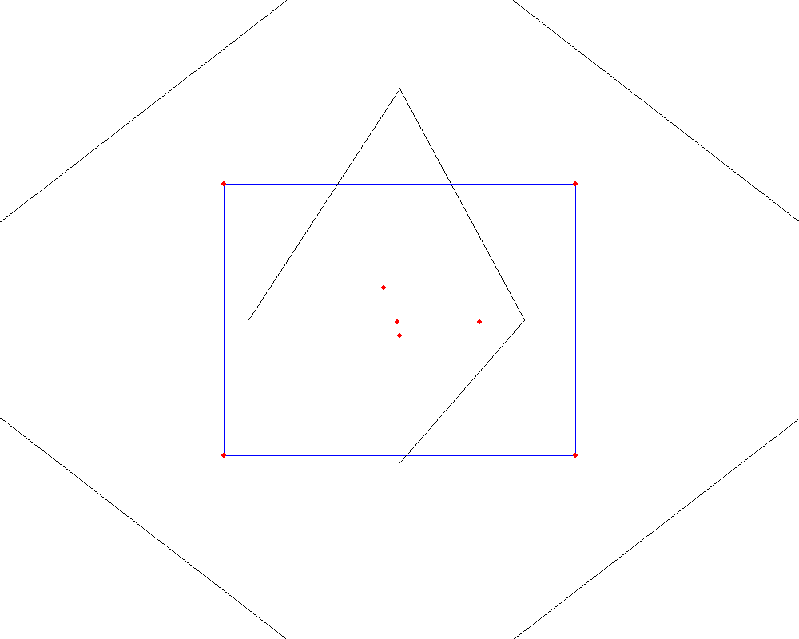

# Implementazione Voronoi in Python

Questa directory contiene l'implementazione nel linguaggio Python dell'algoritmo di Voronoi disponibile presso https://courses.cs.washington.edu/courses/cse326/00wi/projects/voronoi.html

Essendo prevista una successiva implementazione nel linguaggio _Modelica_, sono stati utilizzati soltanto i costrutti Python che sono compatibili con il suddetto linguaggio di modellazione (ad esempio non sono stati utilizzati metodi delle classi)

Viene utilizzata la libreria _pygame_ per mostrare a schermo il funzionamento dell'algoritmo; si prega di notare che la funzione implementata restituisce comunque la lista di celle, che dovrà poi essere utilizzata successivamente

---

## Output dell'algoritmo

**Attenzione**: la seguente immagine è generata automaticamente ogni volta viene eseguito l'algoritmo, di conseguenza potrebbe non essere corretta o aggiornata

